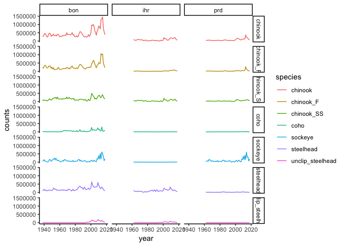

## Data downloaded from Fish Passage Center (FPC) at http://www.fpc.org/fpc_homepage.php

Data are annual counts of all salmon spp at Bonneville (incldes all runs except lower Columbia tribs), Ice Harbor (Snake), and Priest Rapids (upper Columbia).


```r
# call in data
bon <- read.csv("data/BON_annual_count.csv")
ihr <- read.csv("data/IHR_annual_count.csv")
prd <- read.csv("data/PRD_annual_count.csv")
```

## Combine and tidy data sets


```r
bon$dam <- "bon"
ihr$dam <- "ihr"
prd$dam <- "prd"

td <- bind_rows(bon, ihr, prd) %>% 
  select(-lamprey, -shad, -chum, -pink) %>% 
  gather(key = species, value = counts, -year, -dam)
```

## Plot time series


```r
p <- ggplot(td) +
  geom_line(aes(x=year, y=counts, color = species)) +
  theme_classic()

p + facet_grid(species ~ dam)
```

<!-- -->


```r
# just Bonneville Chinook data
bon.chi <- td %>% 
  filter(species == "chinook_SS" & dam == "bon")

bon.chi$year <- as.numeric(bon.chi$year)

dygraph(bon.chi) %>%
  dyOptions(labelsUTC = TRUE, fillGraph=TRUE, fillAlpha=0.1, drawGrid = FALSE, colors="#D8AE5A") %>%
  dyRangeSelector() %>%
  dyCrosshair(direction = "vertical") %>%
  dyHighlight(highlightCircleSize = 5, highlightSeriesBackgroundAlpha = 0.2, hideOnMouseOut = FALSE)  %>%
  dyRoller(rollPeriod = 1)
```

<!--html_preserve--><div id="htmlwidget-4b4e23fe94a2134de762" style="width:672px;height:480px;" class="dygraphs html-widget"></div>
<script type="application/json" data-for="htmlwidget-4b4e23fe94a2134de762">{"x":{"attrs":{"labels":["year","dam","species","counts"],"legend":"auto","retainDateWindow":false,"axes":{"x":{"pixelsPerLabel":60,"drawAxis":true},"y":{"drawAxis":true}},"stackedGraph":false,"fillGraph":true,"fillAlpha":0.1,"stepPlot":false,"drawPoints":false,"pointSize":1,"drawGapEdgePoints":false,"connectSeparatedPoints":false,"strokeWidth":1,"strokeBorderColor":"white","colors":["#D8AE5A"],"colorValue":0.5,"colorSaturation":1,"includeZero":false,"drawAxesAtZero":false,"logscale":false,"axisTickSize":3,"axisLineColor":"black","axisLineWidth":0.3,"axisLabelColor":"black","axisLabelFontSize":14,"axisLabelWidth":60,"drawGrid":false,"gridLineWidth":0.3,"rightGap":5,"digitsAfterDecimal":2,"labelsKMB":false,"labelsKMG2":false,"labelsUTC":true,"maxNumberWidth":6,"animatedZooms":false,"mobileDisableYTouch":true,"disableZoom":false,"showRangeSelector":true,"rangeSelectorHeight":40,"rangeSelectorPlotFillColor":" #A7B1C4","rangeSelectorPlotStrokeColor":"#808FAB","interactionModel":"Dygraph.Interaction.defaultModel","highlightCircleSize":5,"highlightSeriesBackgroundAlpha":0.2,"highlightSeriesOpts":[],"hideOverlayOnMouseOut":false,"showRoller":true,"rollPeriod":1},"annotations":[],"shadings":[],"events":[],"format":"numeric","data":[[1938,1939,1940,1941,1942,1943,1944,1945,1946,1947,1948,1949,1950,1951,1952,1953,1954,1955,1956,1957,1958,1959,1960,1961,1962,1963,1964,1965,1966,1967,1968,1969,1970,1971,1972,1973,1974,1975,1976,1977,1978,1979,1980,1981,1982,1983,1984,1985,1986,1987,1988,1989,1990,1991,1992,1993,1994,1995,1996,1997,1998,1999,2000,2001,2002,2003,2004,2005,2006,2007,2008,2009,2010,2011,2012,2013,2014,2015,2016,2017,2018],["bon","bon","bon","bon","bon","bon","bon","bon","bon","bon","bon","bon","bon","bon","bon","bon","bon","bon","bon","bon","bon","bon","bon","bon","bon","bon","bon","bon","bon","bon","bon","bon","bon","bon","bon","bon","bon","bon","bon","bon","bon","bon","bon","bon","bon","bon","bon","bon","bon","bon","bon","bon","bon","bon","bon","bon","bon","bon","bon","bon","bon","bon","bon","bon","bon","bon","bon","bon","bon","bon","bon","bon","bon","bon","bon","bon","bon","bon","bon","bon","bon"],["chinook_SS","chinook_SS","chinook_SS","chinook_SS","chinook_SS","chinook_SS","chinook_SS","chinook_SS","chinook_SS","chinook_SS","chinook_SS","chinook_SS","chinook_SS","chinook_SS","chinook_SS","chinook_SS","chinook_SS","chinook_SS","chinook_SS","chinook_SS","chinook_SS","chinook_SS","chinook_SS","chinook_SS","chinook_SS","chinook_SS","chinook_SS","chinook_SS","chinook_SS","chinook_SS","chinook_SS","chinook_SS","chinook_SS","chinook_SS","chinook_SS","chinook_SS","chinook_SS","chinook_SS","chinook_SS","chinook_SS","chinook_SS","chinook_SS","chinook_SS","chinook_SS","chinook_SS","chinook_SS","chinook_SS","chinook_SS","chinook_SS","chinook_SS","chinook_SS","chinook_SS","chinook_SS","chinook_SS","chinook_SS","chinook_SS","chinook_SS","chinook_SS","chinook_SS","chinook_SS","chinook_SS","chinook_SS","chinook_SS","chinook_SS","chinook_SS","chinook_SS","chinook_SS","chinook_SS","chinook_SS","chinook_SS","chinook_SS","chinook_SS","chinook_SS","chinook_SS","chinook_SS","chinook_SS","chinook_SS","chinook_SS","chinook_SS","chinook_SS","chinook_SS"],[37148,100185,88344,88703,65108,78984,43469,71135,118857,172322,109965,96806,106893,194171,200483,228108,214163,254535,164649,271473,177105,150085,154767,165156,168601,139485,171959,160262,184666,180594,182080,275760,175878,203428,256970,187508,180431,148455,182461,160531,194186,85679,92052,91938,102658,80296,79546,120831,154084,139514,131270,120234,124273,83181,109827,135788,40097,29636,74172,144828,63228,77551,243731,496418,411385,338194,284225,162044,201240,144820,233031,300526,370243,377822,259579,236448,349253,413259,278785,200426,159756]],"fixedtz":false,"tzone":"","plugins":{"Crosshair":{"direction":"vertical"}}},"evals":["attrs.interactionModel"],"jsHooks":[]}</script><!--/html_preserve-->


```r
# just Bonneville Steelhead unclipped
bon.stlw <- td %>% 
  filter(species == "unclip_steelhead" & dam == "bon")

bon.stlw$year <- as.numeric(bon.stlw$year)

dygraph(bon.stlw) %>%
  dyOptions(labelsUTC = TRUE, fillGraph=TRUE, fillAlpha=0.1, drawGrid = FALSE, colors="#D8AE5A") %>%
  dyRangeSelector() %>%
  dyCrosshair(direction = "vertical") %>%
  dyHighlight(highlightCircleSize = 5, highlightSeriesBackgroundAlpha = 0.2, hideOnMouseOut = FALSE)  %>%
  dyRoller(rollPeriod = 1)
```

<!--html_preserve--><div id="htmlwidget-a58db38a74cf09f00807" style="width:672px;height:480px;" class="dygraphs html-widget"></div>
<script type="application/json" data-for="htmlwidget-a58db38a74cf09f00807">{"x":{"attrs":{"labels":["year","dam","species","counts"],"legend":"auto","retainDateWindow":false,"axes":{"x":{"pixelsPerLabel":60,"drawAxis":true},"y":{"drawAxis":true}},"stackedGraph":false,"fillGraph":true,"fillAlpha":0.1,"stepPlot":false,"drawPoints":false,"pointSize":1,"drawGapEdgePoints":false,"connectSeparatedPoints":false,"strokeWidth":1,"strokeBorderColor":"white","colors":["#D8AE5A"],"colorValue":0.5,"colorSaturation":1,"includeZero":false,"drawAxesAtZero":false,"logscale":false,"axisTickSize":3,"axisLineColor":"black","axisLineWidth":0.3,"axisLabelColor":"black","axisLabelFontSize":14,"axisLabelWidth":60,"drawGrid":false,"gridLineWidth":0.3,"rightGap":5,"digitsAfterDecimal":2,"labelsKMB":false,"labelsKMG2":false,"labelsUTC":true,"maxNumberWidth":6,"animatedZooms":false,"mobileDisableYTouch":true,"disableZoom":false,"showRangeSelector":true,"rangeSelectorHeight":40,"rangeSelectorPlotFillColor":" #A7B1C4","rangeSelectorPlotStrokeColor":"#808FAB","interactionModel":"Dygraph.Interaction.defaultModel","highlightCircleSize":5,"highlightSeriesBackgroundAlpha":0.2,"highlightSeriesOpts":[],"hideOverlayOnMouseOut":false,"showRoller":true,"rollPeriod":1},"annotations":[],"shadings":[],"events":[],"format":"numeric","data":[[1938,1939,1940,1941,1942,1943,1944,1945,1946,1947,1948,1949,1950,1951,1952,1953,1954,1955,1956,1957,1958,1959,1960,1961,1962,1963,1964,1965,1966,1967,1968,1969,1970,1971,1972,1973,1974,1975,1976,1977,1978,1979,1980,1981,1982,1983,1984,1985,1986,1987,1988,1989,1990,1991,1992,1993,1994,1995,1996,1997,1998,1999,2000,2001,2002,2003,2004,2005,2006,2007,2008,2009,2010,2011,2012,2013,2014,2015,2016,2017,2018],["bon","bon","bon","bon","bon","bon","bon","bon","bon","bon","bon","bon","bon","bon","bon","bon","bon","bon","bon","bon","bon","bon","bon","bon","bon","bon","bon","bon","bon","bon","bon","bon","bon","bon","bon","bon","bon","bon","bon","bon","bon","bon","bon","bon","bon","bon","bon","bon","bon","bon","bon","bon","bon","bon","bon","bon","bon","bon","bon","bon","bon","bon","bon","bon","bon","bon","bon","bon","bon","bon","bon","bon","bon","bon","bon","bon","bon","bon","bon","bon","bon"],["unclip_steelhead","unclip_steelhead","unclip_steelhead","unclip_steelhead","unclip_steelhead","unclip_steelhead","unclip_steelhead","unclip_steelhead","unclip_steelhead","unclip_steelhead","unclip_steelhead","unclip_steelhead","unclip_steelhead","unclip_steelhead","unclip_steelhead","unclip_steelhead","unclip_steelhead","unclip_steelhead","unclip_steelhead","unclip_steelhead","unclip_steelhead","unclip_steelhead","unclip_steelhead","unclip_steelhead","unclip_steelhead","unclip_steelhead","unclip_steelhead","unclip_steelhead","unclip_steelhead","unclip_steelhead","unclip_steelhead","unclip_steelhead","unclip_steelhead","unclip_steelhead","unclip_steelhead","unclip_steelhead","unclip_steelhead","unclip_steelhead","unclip_steelhead","unclip_steelhead","unclip_steelhead","unclip_steelhead","unclip_steelhead","unclip_steelhead","unclip_steelhead","unclip_steelhead","unclip_steelhead","unclip_steelhead","unclip_steelhead","unclip_steelhead","unclip_steelhead","unclip_steelhead","unclip_steelhead","unclip_steelhead","unclip_steelhead","unclip_steelhead","unclip_steelhead","unclip_steelhead","unclip_steelhead","unclip_steelhead","unclip_steelhead","unclip_steelhead","unclip_steelhead","unclip_steelhead","unclip_steelhead","unclip_steelhead","unclip_steelhead","unclip_steelhead","unclip_steelhead","unclip_steelhead","unclip_steelhead","unclip_steelhead","unclip_steelhead","unclip_steelhead","unclip_steelhead","unclip_steelhead","unclip_steelhead","unclip_steelhead","unclip_steelhead","unclip_steelhead","unclip_steelhead"],[0,0,0,0,0,0,0,0,0,0,0,0,0,0,0,0,0,0,0,0,0,0,0,0,0,0,0,0,0,0,0,0,0,0,0,0,0,0,0,0,0,0,0,0,0,0,0,0,0,0,0,0,0,0,0,0,29451,28036,30338,33580,35701,55064,76192,149317,143196,112823,97875,88999,85082,82197,105670,172383,156139,129166,85472,99148,130571,97782,52260,34405,33321]],"fixedtz":false,"tzone":"","plugins":{"Crosshair":{"direction":"vertical"}}},"evals":["attrs.interactionModel"],"jsHooks":[]}</script><!--/html_preserve-->

